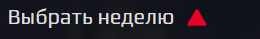
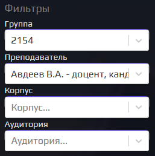
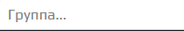
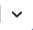
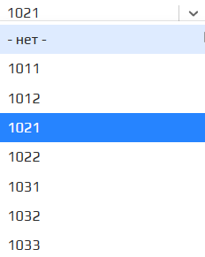
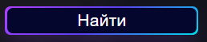
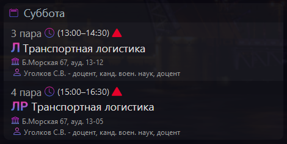

# SUAI Timetable \[remaster\]

## For Developers  

### `npm install`
Installing dependencies

### `npm run start`
Runs the app in the development mode.\
Open [http://localhost:3000](http://localhost:3000) to view it in the browser.

### `npm run build`
Builds the app for production to the `build` folder.\
It correctly bundles React in production mode and optimizes the build for the best performance.

The build is minified and the filenames include the hashes.\
Your app is ready to be deployed!

### `npm lint`  `npm lint:fix`
Runs eslint, eslint config in `.eslintrc` and `.eslintignore` for ignore files.

### `npm run format`
Runs prettier for all project, prettier config in `.prettierrc` and `.prettierignore` for ignore files.

***

## For Users

### You can use last version [Here](https://danzo0l.github.io/guap-raspisanie/)

### Buttons and other usable components

#### Week filter  
> Click on the triangle to change the week filter option  
> **The default is the current week.**  
> 
> 

#### Open sidebar  
> Click bottun Click on the button to show/hide the menu  
> **(only mobile)**  
> 

#### Search filters  
> Use this fields for setting search filters options  
> **(Filters use LocalStorage - after updating page params will be saved)**  
> 
>
> #### Filter field  
>> You can use this field for inputing value from keyboard and list help you select option  
>> Use `DOUBLE CLICK` for clear field   
>>   
>> Click the arrow to expand the list of values  
>>   
>>   
>> **You must select value from list**
>
#### Button submit  
> when you set the necessary filter parameters, click on the button - the application will send a request (It may take quite a while)  
>   

### Timetable visualisation  

#### Day element  
>   
> Element `Content` includes some elements `Day`  
> This elements don't have usable elements, you can only scroll

## Have a good day ; )

